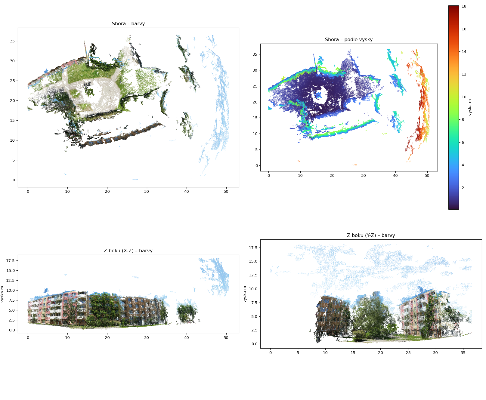
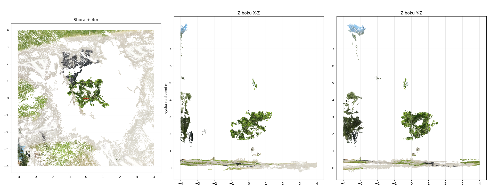
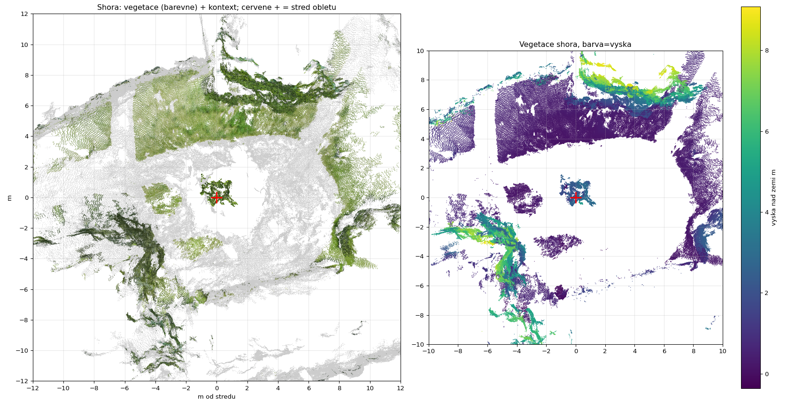
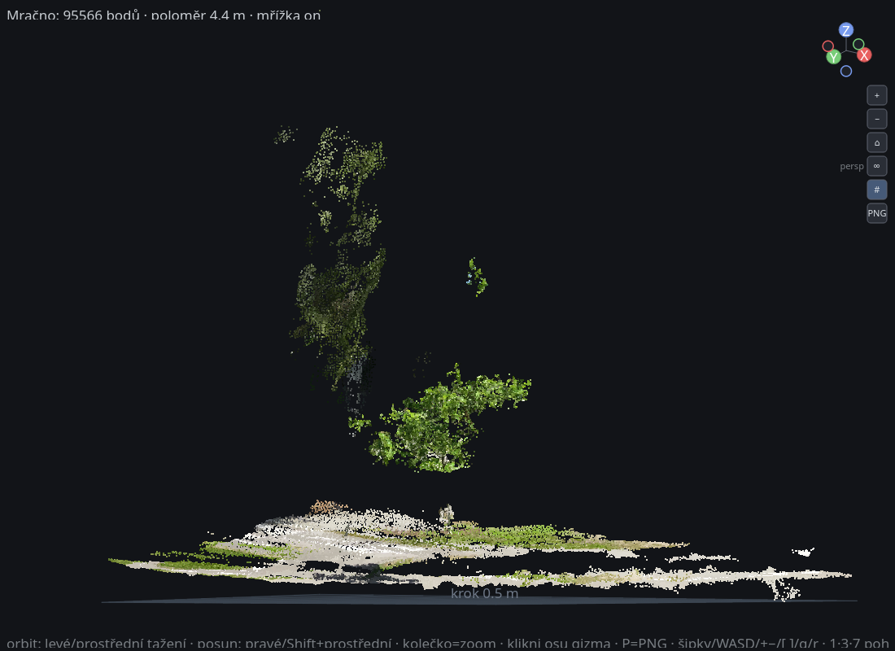

# Učebnice: Od dronového videa ke 3D mračnu bodů

Cílem je **pochopit hlavní myšlenky** za tímhle projektem — ne jen spustit příkazy.
Každá kapitola má: **intuici → trochu hloubky → kde to v projektu je → co zkusit**.

Velký obrázek:
```
fotky stromu (z videa)  →  KDE byla kamera + KDE jsou body  →  mračno bodů  →  obrázek na monitoru
        kap. 3.2/3.3              kap. 3.1/3.3/3.4               kap. 2/4         kap. 6
```

Výsledek (mračno z videa) — pohled shora/z boku, barvy a výška:



Obsah:
1. [Proč vůbec mračno bodů](#1-proč-vůbec-mračno-bodů)
2. [Formát LAS — jak se mračno ukládá](#2-formát-las)
3. [Fotogrammetrie: jak z fotek vznikne 3D](#3-fotogrammetrie)
4. [Souřadnice a georeference](#4-souřadnice-a-georeference)
5. [Telemetrie: SRT → geo.txt](#5-telemetrie-srt--geotxt)
6. [Jak nakreslit 3D na 2D obrazovku](#6-jak-nakreslit-3d-na-2d-obrazovku)
7. [C++ a Qt: jak je viewer postavený](#7-c-a-qt-jak-je-viewer-postavený)
8. [Vlákna, paměť a kdo na co čeká](#8-vlákna-paměť-a-kdo-na-co-čeká)
9. [Inženýrské lekce](#9-inženýrské-lekce)
10. [Slovníček a cvičení](#10-slovníček-a-cvičení)

---

## 1) Proč vůbec mračno bodů

**Intuice.** 3D svět můžeme popsat různě: trojúhelníky (mesh), voxely (kostičky), nebo
**mračnem bodů** — prostě seznam bodů `(x, y, z)`, každý případně s barvou. Je to nejsyrovější
forma 3D měření: skener/algoritmus změří „tady je povrch" a uloží bod.

**Hloubka.** Lidar (Light Detection And Ranging) = laser, který vystřelí puls a změří čas
návratu → vzdálenost → bod. Statisíce až milióny bodů za sekundu. My laser nemáme — body
**dopočítáme z fotek** (kap. 3). Výsledek je ale stejný *druh* dat.

**K čemu:** lesnictví (výška stromů, objem koruny, DBH = průměr kmene), stavařina, mapování,
herní/filmové skeny. Náš `3d-forest/` je přesně analýza lesních lidarových mračen.

**V projektu:** finální `odm_project/strom.las` má **1 332 526 bodů**.

---

## 2) Formát LAS

**Intuice.** `.las` je standardní binární „šuplík na body". `.laz` je jeho zazipovaná verze
(menší, ale musí se rozbalit). Náš 3D Forest umí jen `.las`, proto převádíme (krok 4.4 v README).

**Hloubka.** Soubor má **hlavičku** (kolik bodů, jejich rozsah = bounding box, měřítko/offset,
souřadnicový systém) a pak **pole bodů**. Každý bod má kromě `X,Y,Z` i atributy:
`Intensity, ReturnNumber, Classification, GpsTime, Red, Green, Blue`…

Důležitý trik: souřadnice se ukládají jako **celá čísla** `Xint` + v hlavičce je
`scale` a `offset`, skutečná hodnota = `Xint * scale + offset`. Proč? UTM souřadnice jsou
obří (~623 000 m) a `float` by ztratil přesnost; celé číslo + offset to vyřeší (přesnost daná
`scale`, u nás 0.001 m = 1 mm).

**V projektu.** Náš LAS: `scale = 0.001`, `offset ≈ (623101, 5448931, 0)`, formát 7 (s RGB a GPS časem).
Stejný problém s přesností řešíme i ve vieweru u PLY — viz kap. 6 a komentář „offset" v hlavičce `cloud.ply`.

**Co zkusit:** otevři hlavičku
```bash
.venv/bin/python -c "import laspy;h=laspy.read('odm_project/strom.las').header;print(h.point_count,h.scales,h.offsets,h.mins,h.maxs)"
```

---

## 3) Fotogrammetrie

Jak z 2D fotek vznikne 3D? Klíč: **stejný bod světa vyfocený z více úhlů se dá protnout**
(triangulace). Potřebujeme ale vědět, **odkud** a **jak** každá fotka vznikla.

### 3.1 Kamera = perspektivní projekce (pinhole model)
**Intuice.** Kamera mačká 3D svět na 2D čip. Vzdálené věci jsou menší — to je perspektiva.
Matematicky bod `(X,Y,Z)` v soustavě kamery → pixel:
```
u = f * X/Z + cx
v = f * Y/Z + cy
```
`f` = ohnisko (v pixelech), `(cx,cy)` = střed snímku. To dělení `/Z` je ta perspektiva.
Reálné objektivy navíc **zkreslují** (sudovité zkreslení) → kalibrační koeficienty.

**V projektu.** SRT nese `fnum`/expozici; ODM si ohnisko a zkreslení **sám dopočítá**
(self-calibration), model kamery jsme nastavili `OPENCV` (v Colab notebooku).

### 3.2 Rysy (features) a párování
**Intuice.** Aby algoritmus poznal „tenhle roh okna je na fotce A i B", hledá v obrázcích
**charakteristické body** (rohy, skvrny) a popíše jejich okolí číselným „otiskem" (deskriptor),
který je stejný i při jiném úhlu/světle. Pak páruje stejné otisky mezi fotkami.

**Hloubka.** Klasika je **SIFT**. Páry rysů přes hodně fotek tvoří **korespondence**.
Špatné páry se odfiltrují robustně (RANSAC).

**V projektu.** ODM/COLMAP: `feature_extractor` (SIFT) → `exhaustive_matcher` (porovná všechny
dvojice; u 95 fotek ~4500 párů). V ODM logu jsi viděl `Extracting ROOT_DSPSIFT features…`.

### 3.3 Structure from Motion (SfM) — řídké mračno + pozice kamer
**Intuice.** Z korespondencí jde současně dopočítat **kde byly kamery** a **kde jsou body**.
Je to „slepička–vejce" (abys znal body, potřebuješ kamery a naopak) → řeší se postupně a pak
se vše doladí najednou.

**Hloubka.** To doladění = **bundle adjustment**: minimalizuje *reprojection error* — rozdíl mezi
tím, kam se 3D bod promítne, a kde byl skutečně viděn na fotkách. Výstup: **řídké** mračno
(jen rysy) + přesné pozice/orientace všech kamer.

**V projektu.** COLMAP `mapper` (Colab), v ODM fáze `opensfm`. Výsledek je `sparse/0`.

### 3.4 Multi-View Stereo (MVS) — husté mračno
**Intuice.** Když už víme, kde kamery byly, dopočítáme hloubku **pro každý pixel** (ne jen rysy):
pro pixel ve fotce A najdeme odpovídající pixel ve fotce B → triangulace → bod. Z toho **husté**
mračno (milióny bodů).

**Hloubka.** Dělá se přes *depth maps* (mapa hloubky na každou fotku) a jejich fúzi.
Tahle fáze je **výpočetně nejdražší** (a na CPU nejvíc hřeje; na GPU letí).

**V projektu.** ODM fáze `openmvs` (u tebe ~33–96 % v logu, CPU 400–1000 %, nejvyšší teplota
~73 °C). Na Colabu by to dělal `patch_match_stereo` + `stereo_fusion` → `fused.ply`.

### 3.5 LiDAR vs fotogrammetrie
| | LiDAR | Fotogrammetrie (náš případ) |
|---|---|---|
| princip | laser měří vzdálenost | dopočet z více fotek |
| skrz korunu | částečně proniká | **ne** — vidí jen vnější slupku |
| tenké větve | lépe | šum/díry |
| barva | typicky ne | **ano** (z fotek) |
| měřítko | přímo metrické | nutná georeference/GCP (kap. 4) |

**Proto** náš mladý stromek vyšel nahoře řídký — fotogrammetrie tenké větvičky neutáhne.

Vyříznutý strom (boční pohledy): koruna ve výšce ~1–4 m nad terénem, nahoře řídká:



---

## 4) Souřadnice a georeference

**Intuice.** SfM/MVS samo o sobě dá mračno v **náhodných jednotkách a poloze** (klidně vzhůru
nohama, „velké 7.3 čehosi"). Aby to bylo **v metrech a na správném místě na Zemi**, musíme ho
ukotvit na známé souřadnice — u nás GPS z dronu.

**Hloubka — proč dvě sady souřadnic:**
- **WGS84 (EPSG:4326)** = zeměpisná šířka/délka ve **stupních** (lat, lon). Skvělé pro „kde na
  globusu", **mizerné pro měření v metrech** (stupeň délky má jinou délku na rovníku a u pólu).
- **UTM (u nás zóna 33N, EPSG:32633)** = Zemi rozřežeme na pásy a každý zploštíme na rovinu, kde
  jsou **souřadnice v metrech** (Easting, Northing). Proto má ODM výstup `+proj=utm +zone=33`.
- **EPSG kód** = číselný identifikátor souřadnicového systému (4326 = WGS84, 32633 = UTM 33N).

**Měřítko = slabina.** GPS spotřebního dronu má přesnost ~1–2 m. Náš oblet měl rozptyl kamer
~14 m, takže měřítko *řádově* sedí (panelák ~12–15 m, strom ~3–4 m), ale absolutně je
**±desítky %**. Na centimetry by se musely použít **GCP** (Ground Control Points = body o
**přesně změřené** poloze, viditelné ve fotkách) nebo objekt známé velikosti ve scéně.

**V projektu.** `geo.txt` (krok 4.2) dá ODM GPS → ODM zarovná a převede do UTM (metry).
V Colab variantě totéž dělá `colmap model_aligner` (proto se tam lon/lat prohazuje na lat/lon).

Hledání stromu přes filtr vegetace (zelené body) — pohled shora, `+` = střed obletu kamer:



---

## 5) Telemetrie: SRT → geo.txt

**Intuice.** DJI ukládá vedle videa **`.SRT`** — textový soubor, kde je **na každý frame** GPS,
výška a expozice. My z videa vzali jen každý 12. snímek, takže musíme správnému snímku přiřadit
správný GPS.

**Hloubka.** Klíč je deterministické mapování: extrahovaný `frame_<k>` odpovídá zdrojovému
framu `FrameCnt = 12*(k-1)+1`. `make_geo.py` načte SRT, vytáhne `latitude/longitude/abs_alt`
a zapíše řádky `jméno lon lat alt` (formát, co чека ODM, hlavička `EPSG:4326`).

**V projektu.** `make_geo.py`, výstup `odm_project/images/geo.txt`. Lekce: **data o datech
(metadata) jsou zlato** — bez GPS bychom neměli měřítko ani georeferenci.

---

## 6) Jak nakreslit 3D na 2D obrazovku

Tohle je celý `viewer/` a je to malý kurz 3D grafiky. Renderer je **softwarový** (počítáme
pixely sami v C++), což je super na pochopení principů (žádná „magie GPU").

Náš viewer (perspektiva, mřížka, gizmo X/Y/Z vpravo nahoře, tlačítka, řezy):



### 6.1 Rotace a projekce
**Intuice.** Pohled = otočím scénu (myší) a pak ji „splácnu" na obrazovku.
Otáčení popisují dva úhly: **yaw** (kolem svislé osy Z) a **pitch** (naklonění).

**Hloubka.** Z `PointCloudView::renderInto` (zjednodušeně):
```cpp
// 1) rotace kolem Z (yaw)
x1 =  x*cos(yaw) - y*sin(yaw);
y1 =  x*sin(yaw) + y*cos(yaw);
z1 =  z;
// 2) sklon (pitch): co je „nahoru" na obrazovce a co „do hloubky"
sX = x1;                       // vodorovně na obrazovce
sY = z1*cos(pitch) - y1*sin(pitch);   // svisle (Z = výška jde nahoru)
depth = y1*cos(pitch) + z1*sin(pitch);// do obrazovky (na viditelnost)
```
`sin/cos` jsou stavební kameny rotace (otáčení = míchání dvou souřadnic přes sinus a kosinus).

### 6.2 Ortho vs perspektiva
- **Ortho (paralelní):** `px = ox + sX*scale`. Žádné dělení hloubkou → rovnoběžky zůstanou
  rovnoběžné. Ideální na **kolmé/technické pohledy** (shora, zboku) a měření.
- **Perspektiva:** `px = ox + sX * (focal / (camD + depth))`. Dělení hloubkou → vzdálené
  věci menší (jako oko/kamera, kap. 3.1).

**V projektu.** Přepínač `ortho_` ve vieweru (klávesa 5 / tlačítko); klik na osu gizma přepne
na ortho — jako v Blenderu.

### 6.3 Z-buffer (kdo je vepředu)
**Intuice.** Když dva body padnou na stejný pixel, má vyhrát ten **blíž ke kameře**.
**Hloubka.** Držíme pole `zbuf[pixel]` s dosud nejmenší hloubkou; bod pixel přepíše, jen když má
menší `depth`. Jednoprůchodové, bez třídění.
```cpp
if (depth < zbuf[idx]) { zbuf[idx] = depth; pixel = barva; }
```
**V projektu.** `std::vector<float> zbuf` v `renderInto`. To je v jádru to, co dělá i GPU.

### 6.4 Proč softwarově a ne OpenGL
**Intuice.** Normálně 3D kreslí GPU přes OpenGL. Jenže ty se připojuješ přes **SSH/MobaXterm
(X11 forwarding)** a moderní OpenGL přes vzdálené „indirect GLX" většinou nenaběhne.

**Řešení.** Kreslíme **2D přes QPainter** (čisté X11, žádný GLX) a 3D si promítáme sami
(kap. 6.1–6.3). Cena: pomalejší než GPU (proto `--max` podvzorkování). Zisk: běží to spolehlivě
i na dálku a **rozumíš každému řádku**. Vzor: `../cfd_simple_cube_qt/DomainView3D`.

**Řezací roviny** (kap. žádné nové matematiky): bod zahodíme, když je mimo zvolený `[min,max]`
na některé ose. To je `clipMin/clipMax` filtr v `renderInto`, ovládaný posuvníky v `MainWindow`.

---

## 7) C++ a Qt: jak je viewer postavený

`viewer/` je malá, ale úplná C++ aplikace. Tady je, **co dělá Qt** a **jaké C++ koncepty** tam potkáš.

### Co je Qt
**Intuice.** Qt je velká **C++ knihovna/framework** na desktopové aplikace: okna, tlačítka,
události myši/klávesnice, kreslení, vlákna, sítě… My z něj použili hlavně **Widgets** (okna a
ovládací prvky) a **kreslení** (`QPainter`/`QImage`). Čisté C++ samo o sobě „okno" neumí —
Qt to dodá a je přenositelné (Linux/Win/Mac).

### `main()` a smyčka událostí
```cpp
int main(int argc, char** argv) {
    QApplication app(argc, argv);     // inicializace Qt
    MainWindow win;                   // vytvoř okno
    win.load(path, maxp);
    win.show();
    return app.exec();                // ← smyčka událostí: běží, dokud okno žije
}
```
**Hloubka.** `app.exec()` je **event loop** — Qt v něm čeká na události (klik, překreslení…) a
volá tvoje funkce (handlery). Program „nestojí na místě", reaguje. Bez GUI (náš `--snapshot`)
event loop nepotřebujeme — jen vyrenderujeme obrázek a skončíme.
**V projektu:** `viewer/src/main.cpp`.

### Třída, dědičnost, virtuální funkce (override)
```cpp
class PointCloudView : public QWidget {   // „je to QWidget" → zdědí chování okna
    Q_OBJECT
protected:
    void paintEvent(QPaintEvent*) override;       // Qt nás zavolá, když se má překreslit
    void mousePressEvent(QMouseEvent*) override;  // … a při kliknutí, atd.
};
```
**Intuice.** Dědíme z `QWidget` a **přepisujeme** (`override`) předdefinované metody. Qt je
zavolá ve správný čas (to je princip „framework volá tebe", ne naopak). `virtual`/`override`
je polymorfismus: Qt drží ukazatel na `QWidget`, ale zavolá *naši* verzi `paintEvent`.

### Strom objektů a vlastnictví (proč `new` bez `delete`)
```cpp
view_ = new PointCloudView(this);   // 'this' = rodič
auto* lo = new QSlider(Qt::Horizontal);
```
**Hloubka.** Qt widgety tvoří **strom rodič–dítě**. Když smažeš rodiče, Qt smaže i děti.
Proto vidíš spoustu `new` bez `delete` — o paměť se stará **vlastnictví rodičem** (varianta RAII).
**V projektu:** `MainWindow` je rodič `PointCloudView` i posuvníků.

### `Q_OBJECT`, moc a AUTOMOC
**Intuice.** Makro `Q_OBJECT` zapíná Qt „meta-objektový systém" (signály/sloty, introspekce).
Aby to fungovalo, musí proběhnout **moc** (meta-object compiler) — generátor, který z hlavičky
vyrobí pomocný C++ kód. V CMake to zařídí `set(CMAKE_AUTOMOC ON)`.
**V projektu:** každá naše třída s `Q_OBJECT` (`PointCloudView`, `MainWindow`) + `CMakeLists.txt`.

### Signály a sloty (`connect`)
**Intuice.** Qt komunikuje událostmi: objekt **vyšle signál** („změnila se hodnota"), ty na něj
**napojíš reakci**. Místo callbacků natvrdo je to volné propojení.
```cpp
connect(lo, &QSlider::valueChanged, this, [this,a]{ applyClip(a); });
```
„Když posuvník `lo` změní hodnotu, zavolej moji lambdu, která ořízne osu `a`."
**V projektu:** `MainWindow::MainWindow` (posuvníky řezů → `view_->setClip(...)`).

### Události: kreslení, myš, klávesy
```cpp
void PointCloudView::paintEvent(QPaintEvent*) {
    QImage img(size(), QImage::Format_RGB32);
    renderInto(img);              // náš software renderer (kap. 6)
    QPainter p(this); p.drawImage(0,0,img);
}
void PointCloudView::wheelEvent(QWheelEvent* e) { zoom_ *= ...; update(); }
```
**Hloubka.** `update()` neřekne „kresli teď", ale „naplánuj překreslení" → Qt zavolá `paintEvent`.
`QPainter` kreslí (2D), `QImage` je **buffer pixelů v paměti**. My do něj sáhneme i přímo:
```cpp
uint32_t* row = reinterpret_cast<uint32_t*>(img.scanLine(y));
row[x] = 0xff000000u | (r<<16) | (g<<8) | b;   // ARGB pixel
```
`scanLine(y)` = ukazatel na řádek; `reinterpret_cast` říká „ber tyhle bajty jako 32bit pixely".
To je rychlé a je to přesně to, co děláme v z-bufferu (kap. 6.3).

### Layouty (rozložení)
```cpp
auto* h = new QHBoxLayout(this);
h->addWidget(view_, 1);   // 3D pohled, roztáhni
h->addWidget(panel);      // panel řezů, pevná šířka
```
**Intuice.** Layout sám rozmístí prvky a přepočítá je při změně velikosti okna — nepozicuješ
pixely ručně. `QHBoxLayout` = vedle sebe, `QVBoxLayout` = pod sebou.

### Prvky moderního C++, co tu potkáš
- **`std::vector<ClPoint>`** — dynamické pole bodů; `struct ClPoint { float x,y,z; uint8_t r,g,b; };`
- **Pevné typy** `uint8_t`/`uint32_t` (`<cstdint>`) — přesná velikost (důležité u binárních dat/pixelů).
- **Lambdy** — `[&](...){...}` (zachytí okolí referencí, viz `project` v `renderInto`),
  `[this,a]{...}` (zachytí `this` a kopii `a`, viz `connect`).
- **Reference & const** — `const ClPoint& p` v `for (const auto& p : pts_)`: bez kopírování, nemodifikuje.
- **`std::clamp`, `std::sort`, `std::min/max`** (`<algorithm>`) — ořez rozsahu, třídění os gizma podle hloubky.
- **`std::memcpy`** (`<cstring>`) — čtení `float`/`double` z bajtů PLY (binární parser v `load`).
- **RAII** — `std::ifstream f(...)` se sám zavře na konci scope; `QPainter` ukončí kreslení v destruktoru.
- **`enum`/`switch`** — klávesy v `keyPressEvent` (`case Qt::Key_R: ...`).

### CMake (jak se to staví)
```cmake
set(CMAKE_AUTOMOC ON)                       # spustí moc na Q_OBJECT
find_package(Qt5 REQUIRED COMPONENTS Widgets)
add_executable(viewer src/main.cpp src/PointCloudView.cpp src/MainWindow.cpp)
target_link_libraries(viewer PRIVATE Qt5::Widgets)   # jen Widgets → žádný OpenGL
```
**Intuice.** CMake je „recept na build": najde Qt, řekne které soubory zkompilovat a co slinkovat.
`Qt5::Widgets` je „cíl", který přitáhne hlavičky i knihovny. Build běží v `build/` (out-of-source).

### Mapa tříd (data flow)
```
main.cpp ── vytvoří ──► MainWindow ──┬── PointCloudView (3D pohled, kreslení, vstup)
                                     │      ▲ setClip()
                                     └── QSlider×6 ──signál valueChanged──► applyClip()
PointCloudView::load(PLY) → std::vector<ClPoint> → renderInto(QImage) → paintEvent → na obrazovku
```
Tři malé soubory, jasné role: `main` (spuštění), `MainWindow` (okno+panel), `PointCloudView`
(mračno + render + ovládání). Tohle je hezký vzor i pro pohovor: **oddělení odpovědností**.

---

## 8) Vlákna, paměť a kdo na co čeká

**Intuice.** *Vlákno* (thread) = nezávislý proud výpočtu uvnitř programu; víc vláken běží
„najednou" na víc jádrech. Dvě motivace: (1) **GUI nesmí zamrznout** — dlouhý výpočet patří
mimo hlavní vlákno; (2) **využít všechna jádra** — rozdělit práci.

### A) Hlavní (GUI) vlákno a event loop
`app.exec()` (kap. 7) běží v **hlavním vlákně** a tam se **smí kreslit a sahat na widgety**.
To vlákno „čeká" na události a obsluhuje je. Když do něj dáš dlouhý výpočet, okno se přestane
překreslovat (zamrzne). **V našem vieweru** je render rychlý, takže jede jednovláknově — ale
kdyby se načítalo obří mračno, patří to do worker vlákna (viz cvičení).

### B) Worker vlákno + bezpečná komunikace (reálný příklad: `SolverWorker`)
V sousedním `cfd_simple_cube_qt` běží výpočet ve **vlastním vlákně** a s GUI mluví **jen přes
signály/sloty** — Qt zprávu **bezpečně předá** do fronty cílového vlákna (queued connection),
takže se nesahá na widget z cizího vlákna.
```cpp
// SolverWorker.hpp (zkráceno)
public slots:  void run(SimParams p);            // poběží ve worker vlákně
signals:       void iteration(int it, double r); // → GUI je dostane ve své frontě
               void finished(bool ok, int iters);
private:
    std::atomic<bool> stopRequested_{false};     // čte se za běhu smyčky, BEZ zámku
```
**Kdo na co čeká:** GUI **nečeká** — běží dál a reaguje (třeba na tlačítko Stop). Worker počítá
a posílá průběh; GUI si snapshoty vyzvedne, až na ně ve své smyčce „dojde". Stop se předá přes
**`std::atomic<bool>`** — proměnnou, kterou smí číst/psát víc vláken **bez porušení** (atomická
operace). Proto `stop()` jen nastaví `stopRequested_=true` a výpočetní smyčka to při další
iteraci uvidí.

### C) Datová paralelizace (víc jader na jednu úlohu)
Když chceš úlohu zrychlit, rozdělíš data mezi vlákna.
- **OpenMP** v CFD řešiči: `omp_set_num_threads(...)` → smyčka přes buňky mřížky běží paralelně.
- **Naše pipeline:** ODM/OpenMVS a `ffmpeg -threads` dělají totéž interně. Když jsi v monitoru
  viděl **CPU 400 %**, znamenalo to ~4 běžící vlákna (4 jádra naplno); OpenMVS si v špičce vzal
  i ~1000 % (10 jader), protože má **vlastní** správu vláken nezávislou na `--max-concurrency`.

### D) Na co si dát pozor (synchronizace)
- **Race condition** (souběh): dvě vlákna sahají na stejnou paměť a aspoň jedno zapisuje →
  nedefinovaný výsledek. Řeší se **zámkem (`std::mutex`)** nebo **atomikou** (pro jednoduché
  vlajky/čítače je atomika levnější — viz `stopRequested_`).
- **Deadlock**: A čeká na zámek, co drží B, a B čeká na zámek, co drží A → stojí navždy.
  ("Kdo na co čeká" do kruhu.) Prevence: ber zámky vždy ve stejném pořadí, drž je krátce.
- **Pravidlo Qt:** s widgety/GUI pracuj jen z hlavního vlákna; mezi vlákny posílej **signály**
  (Qt zařídí bezpečné předání), ne přímé volání.

### E) Paměť — kde data leží
- **Zásobník (stack):** lokální proměnné, malé a krátkožijící (`double x`, `QPointF p`).
  Automaticky se uklidí na konci scope.
- **Halda (heap):** velká/dlouhožijící data. Náš `std::vector<ClPoint> pts_` drží mračno na
  haldě: 1,33 M × `sizeof(ClPoint)` (3×`float` + 3×`uint8_t` ≈ 16 B) ≈ **~21 MB**. `std::vector`
  si haldu spravuje sám (alokace/uvolnění) — to je **RAII**.
- **Per-snímek alokace:** v `renderInto` vzniká `std::vector<float> zbuf` o velikosti `w*h`
  na každé překreslení a po něm se uvolní — krátkožijící, ale velké; proto ho nechceme zbytečně
  velký (a proto `--max` podvzorkování u velkých mračen).
- **Vlastnictví:** `std::unique_ptr<ChannelSolver> sim_` (jediný vlastník, uvolní se sám) a
  **Qt strom rodič–dítě** (kap. 7) — kdo „vlastní", ten uklízí. Sdílené atomiky naopak žijí tak
  dlouho, dokud žije worker, a sahají na ně obě vlákna.
- **Reference vs kopie:** `for (const auto& p : pts_)` jede přes **reference** — kdyby tam bylo
  `auto p` (kopie), kopírovali bychom 21 MB bodů zbytečně. Detail, který u miliónů prvků rozhoduje.

### F) Souběh i mimo program (procesy a čekání v naší pipeline)
Paralelně neběží jen vlákna, ale i **procesy**:
- ODM jsme spustili **na pozadí** (`&` / background task) → hlavní shell „nečekal".
- **Watchdog** byl samostatná smyčka, co `sleep 15` (spí = čeká) a každých 15 s četl teplotu;
  při >90 °C poslal `docker stop` (signál procesu, ať skončí).
- **Monitor** četl ODM log (fáze k/13, %). My (agent) jsme „čekali" na **task-notification**, až
  ODM doběhne. To je úplně stejný princip „kdo na co čeká", jen na úrovni procesů, ne vláken.

---

## 9) Inženýrské lekce

Projekt není jen matematika — hodně se naučíš na omezeních:

- **CPU vs GPU.** Husté MVS na GPU letí, ale neměli jsme NVIDIA → **OpenDroneMap na CPU**.
  Ponaučení: vyber nástroj podle hardwaru, ne naopak.
- **Teplo je fyzický limit.** Dlouhý 100% load na slabě chlazeném stroji → throttling/riziko.
  Řešení: **omezit jádra** (`--max-concurrency`) + **watchdog** čte `x86_pkg_temp` a zabije job
  nad 90 °C. (Měření > odhady.)
- **Izolace prostředí.** `sudo` s heslem a PEP 668 → vše do **`.venv`** a **Dockeru**, nic do
  systému. Reprodukovatelné a bezpečné.
- **Vzdálený přístup mění architekturu.** „Poběží to přes MobaXterm?" rozhodlo, že viewer je
  softwarový. Návrh vždy zohledni, *kde a jak* se to bude spouštět.
- **Headless testování.** `QT_QPA_PLATFORM=offscreen` + `--snapshot` umožní GUI „otestovat"
  bez obrazovky (vyrenderuje PNG). Šikovné pro CI i pro mě.
- **Dělej věci na pozadí a měř průběh.** ODM běželo na pozadí, k tomu monitor (fáze k/13 + %) a
  watchdog. Dlouhé úlohy chtějí viditelnost a pojistku.

---

## 10) Slovníček a cvičení

**Slovníček**
- **Point cloud / mračno bodů** — seznam 3D bodů (+ barva/atributy).
- **SfM** — Structure from Motion: dopočet pozic kamer + řídkého mračna z fotek.
- **MVS** — Multi-View Stereo: husté mračno (hloubka na každý pixel).
- **Bundle adjustment** — globální doladění kamer a bodů (minimalizace reprojection erroru).
- **Feature/deskriptor (SIFT)** — charakteristický bod a jeho „otisk" pro párování.
- **Georeference** — ukotvení modelu do reálných souřadnic (metry).
- **WGS84/UTM/EPSG** — zeměpisné stupně / metrické pásy / kódy systémů.
- **GCP** — přesně zaměřený kontrolní bod pro měřítko/polohu.
- **Z-buffer** — kdo je blíž, ten je vidět.
- **Ortho/perspektiva** — bez/s dělením hloubkou.
- **GLX / indirect rendering** — OpenGL přes síťové X11 (proto raději software render).
- **Vlákno (thread)** — nezávislý proud výpočtu; víc jich běží na víc jádrech.
- **Event loop** — smyčka (`app.exec()`), co čeká na události a volá tvoje handlery.
- **Race condition / mutex / atomic** — souběžný přístup k paměti / zámek / lock-free proměnná.
- **Deadlock** — vlákna se navzájem čekají dokola a stojí.
- **Zásobník vs halda (stack/heap)** — malé krátkožijící vs velké/dlouhožijící data.
- **RAII** — zdroj se uklidí v destruktoru (`std::vector`, `unique_ptr`, `ifstream`, `QPainter`).

**Cvičení (od lehkého)**
1. Vypiš hlavičku LAS (kap. 2) a spočítej výšku scény z `mins/maxs[2]`.
2. Ve vieweru klikni na osu Z (pohled shora, ortho) a změř očima rozteč mřížky vs. realitu.
3. Změň v `renderInto` `splat_` nebo barvu pozadí, přebuilduj, udělej `--snapshot`.
4. V `make_geo.py` použij `rel_alt` místo `abs_alt` a porovnej, co to udělá s výškou.
5. Přepni ODM na `--feature-quality high --pc-quality high` (na chladnějším i7) a porovnej
   počet bodů a detail stromu.
6. Doplň do vieweru **obarvení podle výšky** (místo RGB barvu po čítej z `z`) — malý zásah do
   `renderInto`, hodně se naučíš o mapování hodnota→barva.
7. (vlákna) Načti velký PLY **ve worker vlákně** (`QThread`/`std::thread`), GUI ať nezamrzne;
   po dokončení pošli **signál** „hotovo, překresli" — viz vzor `SolverWorker` (kap. 8).

**Kam dál:** COLMAP/OpenDroneMap dokumentace (SfM/MVS), „Multiple View Geometry" (Hartley &
Zisserman) na teorii, „Real-Time Rendering" / LearnOpenGL na grafiku, PDAL/laspy na práci s LAS.
```
